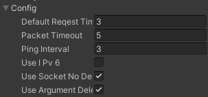

## Connector

GameAnvil 커넥터를 사용하려면 먼저 Connector를 생성해야 합니다. 기본 설정과 에이전트 관리를 담당하며, 내부 동작과 관련된 로그를 볼 수 있도록 콜백을 등록할 수 있습니다.

### 생성

다음과 같이 Connecor를 생성할 수 있습니다.

``` C#
using GameAnvil;
Connector connector = new Connector();
```

### 설정

Connector가 동작에 사용되는 설정이 있습니다. 이 설정들은 Connector 생성시 기본값으로 설정되지만 필요하다면 다음과 같이 직접 값을 바꿀 수 있습니다. 

``` C#
using GameAnvil;
Connector connector = new Connector();
connector.config.packetTimeout = 10;
```

`Connector.Config`를 미리 생성해놓고 이를 인자로 받아서 Connector 를 생성할 수도 있습니다. 또 이렇게 생성한`Connector.Config`를 MonoBehavior의 맴버로 만들어 놓을 경우 Unity의 Inspector 창에서 설정값을 바꿀 수도 있습니다. 

``` C#
using GameAnvil;
var config = new Connector.Config();
config.packetTimeout = 10;
Connector connector = new Connector(config);
```



설정의 종류는 다음과 같습니다.

| 이름                 | 설명                                                         | 기본값 |
| -------------------- | ------------------------------------------------------------ | ------ |
| defaultReqestTimeout | TimeOut 기본 대기시간 설정                                   | 3(sec) |
| packetTimeout        | 패킷이 지정된 시간안에 업데이트 되지 않으면, disconnect 되었다고 판단된다. pingInterval 보다 높게 설정되야 한다. | 5(sec) |
| pingInterval         | 서버와의 연결을 확인하기 위한 ping 주기 설정. 0일경우 사용안함 | 3(sec) |
| useIPv6              | 접속시 IPv6 주소로 변환 여부                                 | false  |
| useSocketNoDelay     | 소켓의 Nodelay 사용 여부                                     | true   |


### 로그

Connector는 직접 로그를 남기지 않고 콜백을 통해 로그를 전달합니다. 다음과 같이 콜백을 등록해야 Connector에서 발생하는 로그를 받을 수 있습니다. 

``` c#
connector = new GameAnvil.Connector();
connector.Logger += (level, log) =>
{
Debug.Log(string.Format("Log[{0}]:{1}", level, log));
};
connector.LvNetLogger += (level, log) =>
{
Debug.Log(string.Format("Net[{0}]:{1}", level, log));
};
```

Connector.Logger는 Connector에서 발생한 에러나 경고등에 대한 로그를 전달하고, Connector.LvNetLogger는 Connector와 서버가 주고받는 Packet을 처리에 대한 로그를 전달하며 그 양이 많습니다. Connector.LvNetLogger는 개발중에만 사용하길 권장합니다. 

### Update

서버와 주고받는 메시지 처리를 위해 Update() 함수를 주기적으로 호출해야 합니다. MonoBehaviour의 Update() 에서 호출하도록 하는것이 제일 간편한방법이지만, 필요에 따라 다른 방식으로 호출해도 무방합니다만 Thread safe하지 않으므로 별도의 Thread에서 호출하면 안됩니다. Update() 함수의 호출 주기는 자유롭게 설정해도 되지만 호출하지 않을 경우 서버로부터 메시지를 받더라도 이에 대한 알림을 받을 수 없습니다.

```c#
connector.Update();
```

### ConnectorHandler

gameanvil-connector.unitypackage를 설치하면 Assets/GameAnvil/script 폴더에 다음과 같이 MonoBehaviour를 상속받아 커넥터를 관리하는 ConnectorHandler 스크립트가 포함되어 있습니다. ConnectorHandler를 씬의 GameObject에 추가하여 사용할 수 있습니다. 

```c#
using GameAnvil.Connection;
using UnityEngine;

namespace GameAnvil
{
    public class ConnectorHandler : MonoBehaviour
    {

        private static ConnectorHandler instance;
        public static Connector connector = null;
        public ConnectionAgent connectionAgent;

        [Header("Configuration")]
        public Connector.Config config;
        public int PauseClientStateCheckMiliSecond = 10 * 60;

        private void Awake()
        {
            if (instance == null)
            {
                instance = this;
                DontDestroyOnLoad(gameObject);
                connector = new Connector(config);
                connectionAgent = connector.GetConnectionAgent();
            } else
            {
                Debug.Log("ConnectorHandler instance already exist. Destroy new one.");
                Destroy(gameObject);
            }
        }

        private void Update()
        {
            connector.Update();
        }

        void OnDisable()
        {
            if (connector.IsConnected())
            {
                connector.CloseSocket();
            }
        }

        private void OnApplicationPause(bool pause)
        {
            if (pause)
            {
                connector.GetConnectionAgent().PauseClientStateCheck(PauseClientStateCheckMiliSecond);
                connector.Update();
            } else
            {
                connector.Update();
                connector.GetConnectionAgent().ResumeClientStateCheck();
            }
        }
    }
}
```

이 스크립트는 예시이며 필요에 따라 새로 만들거나 적절하게 변경해 사용하면 됩니다. 

이제 GameAnvil 커넥터의 사용 준비가 완료되었습니다.